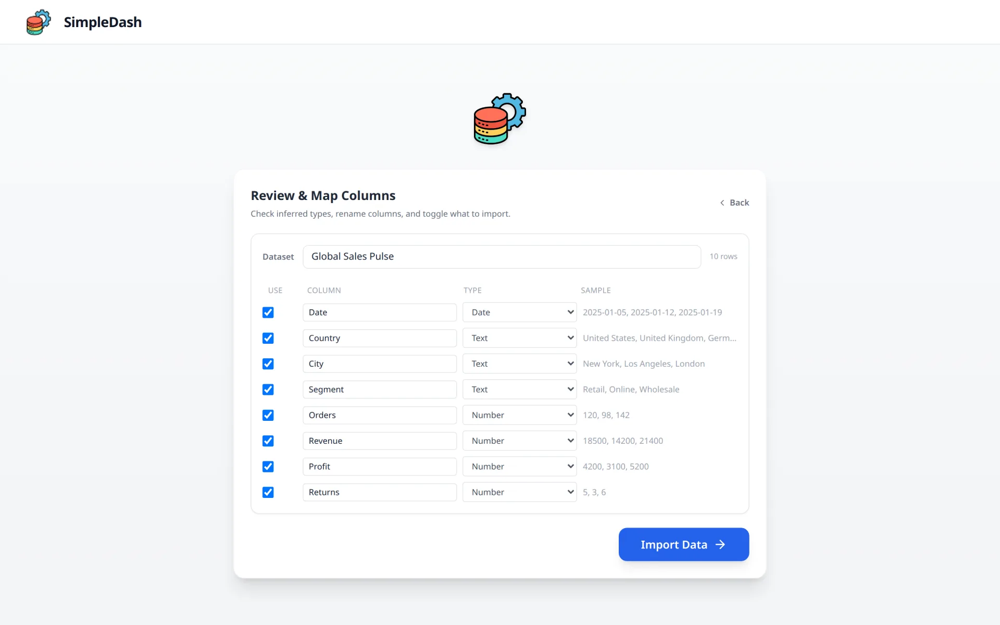
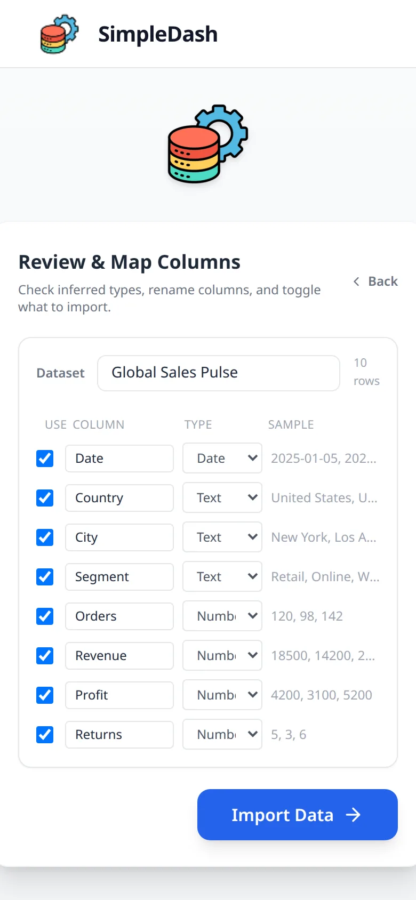

# EasyBI — Lightweight BI Dashboard

> Paste your data. Build a dashboard. Export in seconds.

EasyBI is a zero-setup business intelligence tool built for analysts and finance teams who need quick KPI visualizations without the complexity of Power BI or Tableau.

> Note: the in-app branding currently shows "SimpleDash" — that's a working title from an early iteration. The project, repo, and roadmap are all "EasyBI"; the rename in the UI is on the backlog.

<table align="center">
  <tr>
    <td align="center" width="70%">
      
      <br><sub><b>Desktop</b> — Review &amp; Map Columns: type detection + sample preview</sub>
    </td>
    <td align="center" width="30%">
      
      <br><sub><b>Mobile</b> — paste data on the go</sub>
    </td>
  </tr>
</table>

## Features

- **Instant Data Import** — paste raw text or upload CSV/XLSX files
- **Drag & Drop Layout** — arrange KPI cards and charts freely with multi-panel support
- **Chart Types** — bar, line, area, pie, scatter, and geo maps (Recharts + D3)
- **KPI Cards** — auto-calculated metrics with trend indicators
- **AI Suggestions** — smart chart recommendations based on your data shape
- **Export** — download as PNG, JPEG, or PDF; save/load full project as JSON
- **Themes** — light/dark mode with custom color palette management

## Tech Stack

| Layer | Tech |
|---|---|
| Framework | React 19 + Vite 6 |
| Styling | Tailwind CSS + Framer Motion |
| Charts | Recharts 3 |
| Drag & Drop | @dnd-kit |
| Export | html2canvas + jsPDF |
| Data Parsing | xlsx |

## Getting Started

```bash
git clone https://github.com/mmeekh/EasyBI.git
cd EasyBI
npm install
npm run dev
```

Open [http://localhost:5173](http://localhost:5173) in your browser.

### Build for production

```bash
npm run build
npm run preview
```

## Project Structure

```
EasyBI/
├── App.tsx              # Root component & export/import logic
├── components/          # UI components (charts, grid, panels)
├── hooks/               # Dashboard state & persistence
├── utils/               # Excel parser, color utils, geo helpers
└── constants.ts         # Themes and global config
```

## Why I built this

I worked as a Reporting & Statistics Specialist at Acun Media Global, building executive Power BI dashboards that cut reporting cycle times by ~30%. Power BI is powerful, but for the **first 80% of an analyst's job** — paste a few columns, see a trend, share a chart with a colleague — it is slow to set up, license-locked, and overkill.

EasyBI is the tool I wanted on those days: a finance-team-friendly companion to Power BI, not a replacement.

- **Paste a CSV column or drop an Excel file** — column types are inferred and previewed before import.
- **No accounts, no workspaces, no per-user licensing.** Open the page, paste data, build the chart.
- **Export the whole dashboard as PNG / PDF / JSON** — the JSON acts as a save file you can re-open or share over Slack.
- **The data never leaves the browser.** Everything is parsed and rendered client-side, which matters when the spreadsheet you're analyzing has internal P&L numbers in it.

This is a tool built by someone who has done the actual reporting work, for people who do it daily.

## Roadmap

- [ ] Rename in-app branding from "SimpleDash" to "EasyBI"
- [ ] Direct Excel range pasting (preserve cell formatting)
- [ ] LLM-assisted "ask a question about this dataset" panel
- [ ] Saved templates for common finance dashboards (P&L, AR aging, OPEX trend)

---

Built by [Muhammet Emin Kilic](https://linkedin.com/in/emin-kilic-250b14210) — Finance-Tech Hybrid, Istanbul.
